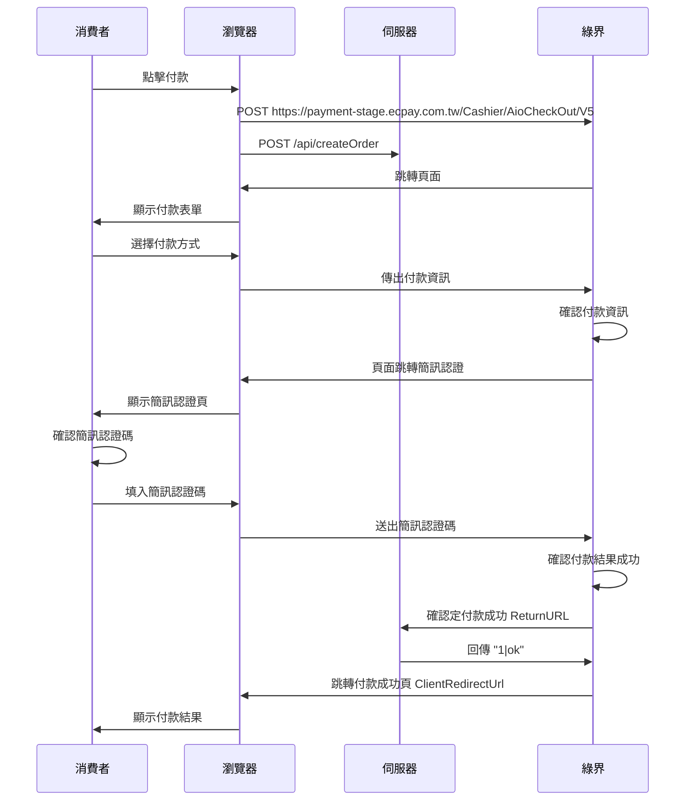

# FruitXu.github.io

```mermaid
sequenceDiagram
 
    
    participant user as 消費者
    participant client as 瀏覽器
    participant server as 伺服器
    participant ecpay as 綠界
 
    user->>client: 點擊付款
    client->>ecpay: POST https://payment-stage.ecpay.com.tw/Cashier/AioCheckOut/V5
    client->>server: POST /api/createOrder
    ecpay->>client: 跳轉頁面
    client->>user: 顯示付款表單
    user->>client: 選擇付款方式
    client->>ecpay: 傳出付款資訊
    ecpay->>ecpay: 確認付款資訊
    ecpay->>client: 頁面跳轉簡訊認證
    client->>user: 顯示簡訊認證頁
    user->>user: 確認簡訊認證碼
    user->>client: 填入簡訊認證碼
    client->>ecpay : 送出簡訊認證碼
    ecpay->>ecpay: 確認付款結果成功
    ecpay->>server: 確認定付款成功 ReturnURL
    server->>ecpay: 回傳 "1|ok"
    ecpay->>client: 跳轉付款成功頁 ClientRedirectUrl
    client->>user: 顯示付款結果
```
